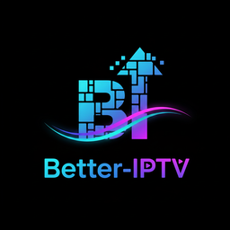

<div align="center">
  

  # Better IPTV

  **Modern, cross-platform IPTV player built with Rust and Tauri**

  [](https://github.com/mewset/better-iptv/actions)
  [](https://github.com/mewset/better-iptv/actions)
  [](#-installation)
  [](https://aur.archlinux.org/packages/better-iptv-bin)
  [](LICENSE)

  [Features](#-features) • [Installation](#-installation) • [Quick Start](#-quick-start) • [FAQ](#-faq) • [Contributing](#-contributing)
</div>

---

## 📺 Overview

Better IPTV is a powerful desktop IPTV player that combines the performance of Rust with the flexibility of a modern web UI. Built on MPV for reliable video playback, it handles everything from live TV to movies and series with ease.

**Why Better IPTV?**
- 🚀 **Fast & Efficient** - Rust backend handles 100,000+ channels without breaking a sweat
- 🎯 **Smart Features** - EPG, parental controls, multi-profile support, and more
- 🎨 **Modern UI** - Clean, responsive interface with dark/light themes
- 🔒 **Privacy First** - All data stored locally, credentials never leave your device
- 🌍 **Cross-Platform** - One app for Linux, Windows, and macOS

---

## ✨ Features

### 🎬 Complete Content Library
- **Live TV** - Stream live channels with real-time Electronic Program Guide (EPG)
- **Movies (VOD)** - Browse and watch thousands of on-demand movies
- **TV Series** - Automatic episode playlists with season/episode organization
- **Smart Search** - Instant filtering across all content types
- **Virtual Scrolling** - Smooth performance with massive playlists (tested with 100K+ channels)

### 🔒 Family-Friendly Parental Controls
> **New in v2.3.0**

Protect your family with comprehensive content restrictions:
- **Secure PIN Protection** - 4-6 digit PIN with industry-standard Argon2 encryption
- **Manual Channel Blocking** - Select specific channels to restrict (with virtualized selection for smooth performance)
- **Auto-Detection** - Automatically identifies and blocks adult content (+18, XXX, Adult markers)
- **Category Blocking** - Block entire channel groups at once
- **Three Viewing Modes**:
  - **Hide** - Completely remove blocked channels from view
  - **Lock Icon** - Show with lock indicator, unlock with PIN
  - **Blur** - Show blurred thumbnail, unlock to watch
- **Session-Based** - Temporary unlock during session, auto-locks on restart

### 📋 Flexible Playlist Management
- **M3U/M3U8 Support** - Import from local files or URLs
- **Xtream Codes Integration** - Direct connection to your IPTV provider
- **Multi-Profile System** - Switch between multiple providers/playlists
- **Favorites** - Star any channel, movie, or series and find them all in a dedicated Favorites tab
- **Custom User-Agent** - Choose between Default, TiviMate, VLC, or custom User-Agent for provider compatibility
- **Category Quick-Access** - Horizontal bar for instant category filtering

### 🌐 Language & Accessibility
- **19 Language Support** - Audio and subtitle preferences for:
  - Scandinavian: Swedish, Norwegian, Danish, Finnish
  - European: English, German, French, Spanish, Italian, Portuguese, Dutch, Polish, Russian
  - International: Arabic, Turkish, Japanese, Chinese, Korean
- **Per-Profile Settings** - Different language preferences for each profile

### 🚀 Performance & Reliability
- **MPV Integration** - Industry-standard player with all codecs supported
- **Hardware Acceleration** - Automatic GPU usage for smooth playback
- **SQLite Database** - Lightning-fast local storage
- **Batch Processing** - Efficiently handles large playlist imports
- **Error Boundaries** - Graceful degradation, no full-app crashes

---

## 📥 Installation

### System Requirements

#### MPV Media Player

Better IPTV uses MPV for video playback. Installation varies by platform:

**Linux:**
```bash
# Ubuntu/Debian
sudo apt install mpv

# Arch Linux
sudo pacman -S mpv

# Fedora
sudo dnf install mpv
```

**macOS:**
```bash
brew install mpv
```

**Windows:**
> **🎉 New in v2.3.0:** Windows users no longer need to install MPV separately! It's now bundled with the installer.

If you prefer a manual installation or already have MPV:
- Download from [mpv.io](https://mpv.io/installation/)
- Or use Chocolatey: `choco install mpv`

### Download Better IPTV

**Pre-built Packages:**
1. Visit [Releases](https://github.com/mewset/better-iptv/releases/latest)
2. Download for your platform:
   - **Linux**: `.AppImage` (universal), `.deb` (Ubuntu/Debian), `.rpm` (Fedora/RHEL)
   - **Windows**: `.msi` installer or `.exe` portable
   - **macOS**: `.dmg` disk image

**Linux AppImage:**
```bash
chmod +x Better-IPTV.AppImage
./Better-IPTV.AppImage
```

**Build from Source:**
```bash
git clone https://github.com/mewset/better-iptv.git
cd better-iptv
npm install
npm run tauri build
# Output: src-tauri/target/release/bundle/
```

---

## 🚀 Quick Start

### 1️⃣ Launch & Setup

On first launch, you'll see the setup screen. Choose your import method:

### 2️⃣ Import Playlist

**Option A: M3U/M3U8 File**
1. Click **"Import M3U Playlist"**
2. Enter a profile name (e.g., "My IPTV")
3. Choose source:
   - **Local File**: Browse to your `.m3u`/`.m3u8` file
   - **URL**: Paste your playlist URL
4. Click **"Import"** and wait for channels to load

**Option B: Xtream Codes**
1. Click **"Import Xtream Playlist"**
2. Enter a profile name
3. Fill in credentials:
   - **Server URL**: `http://server.com:port`
   - **Username**: Your username
   - **Password**: Your password
4. Click **"Import"** (loads Live TV, Movies, and Series)

### 3️⃣ Configure EPG (Optional)

1. Open **Settings** (gear icon)
2. Navigate to **General** → **EPG Settings**
3. Enter your XMLTV EPG URL (Xtream users get this automatically!)
4. Click **"Update Now"** to fetch EPG data
5. EPG updates automatically going forward

### 4️⃣ Start Watching!

- **Browse**: Use tabs (All/Live TV/Movies/Series/Favorites) and category bar
- **Search**: Type in search box for instant filtering
- **Play**: Click play button on any channel
- **Enjoy**: MPV opens in separate window with full playback controls

---

## 💡 Usage Tips

### Content Navigation
- **Tabs**: Filter by All, Live TV, Movies, Series, or Favorites
- **Category Bar**: Horizontal scroll for quick category access
- **Search**: Real-time filtering by channel/group name
- **Favorites**: Hover over any channel card and click the star to add/remove favorites

### Watching Series
1. Go to **Series** tab
2. Select a series to open details
3. Choose season from dropdown
4. Click **Play** on any episode → remaining episodes auto-queue

### Multiple Profiles
- Import multiple playlists as separate profiles
- Switch profiles from setup screen
- Each profile maintains independent channels, favorites, and settings

### Parental Controls
1. Open **Settings** → **Parental Controls**
2. Set a PIN (4-6 digits)
3. Choose blocking method:
   - Manual selection
   - Auto-detect adult content
   - Category blocking
4. Select viewing mode (Hide/Lock/Blur)
5. Save settings

---

## 🎮 Keyboard Shortcuts

*In-app shortcuts:*

| Key | Action |
|-----|--------|
| `Space` | Play/Stop current channel |
| `/` | Focus search bar |
| `Escape` | Stop playback |
| `Ctrl+1-4` | Switch settings tabs |

*Within MPV player window:*

| Key | Action |
|-----|--------|
| `Space` | Play/Pause |
| `F` | Toggle Fullscreen |
| `↑` / `↓` | Volume Up/Down |
| `←` / `→` | Seek Backward/Forward (10s) |
| `M` | Mute/Unmute |
| `Q` | Quit Player |
| `Esc` | Exit Fullscreen |

---

## ❓ FAQ

<details>
<summary><strong>Why won't MPV open?</strong></summary>

MPV must be installed on your system (except Windows v2.3.0+ which includes it bundled).

Verify installation:
```bash
mpv --version
```

See [Installation](#-installation) for platform-specific instructions.
</details>

<details>
<summary><strong>Can I watch channels directly in the app?</strong></summary>

No, Better IPTV uses MPV as an external player. This provides superior codec support and performance, but video displays in a separate window.
</details>

<details>
<summary><strong>EPG data not showing?</strong></summary>

Check:
1. Playlist contains EPG identifiers (`tvg-id` or `tvg-name`)
2. EPG URL configured in Settings → EPG Settings
3. EPG data fetched (click "Fetch EPG" button)
4. Wait a minute for EPG refresh cycle
</details>

<details>
<summary><strong>How many channels can it handle?</strong></summary>

Better IPTV uses virtual scrolling and batch processing to handle 50,000+ channels without performance degradation. Better-IPTV has been using a 150.000+ channel playlist during development without any problems.
</details>

<details>
<summary><strong>Does it work with VPN?</strong></summary>

Yes! Ensure your VPN is active before launching streams.
</details>

<details>
<summary><strong>Are my Xtream credentials secure?</strong></summary>

Absolutely. All credentials are stored locally in an SQLite database on your device. Nothing is sent to external servers. Logs automatically mask sensitive data.
</details>

<details>
<summary><strong>Can I play local video files?</strong></summary>

No, Better IPTV is designed exclusively for IPTV streams. Use MPV directly for local media.
</details>

---

## 🛠️ Troubleshooting

### Channels Buffering
- **Check internet connection** - Run speed test
- **Try another channel** - May be provider/server issue
- **Adjust MPV cache** - Advanced users: edit MPV config

### Series Not Importing (Xtream)
- **Verify credentials** - Double-check username/password
- **Check provider support** - Not all Xtream providers offer series
- **Retry import** - Network issues may cause partial imports

### App Won't Start
- **Linux**: Ensure `.AppImage` has execute permissions (`chmod +x`)
- **Windows**: Run as administrator or check Windows Defender
- **macOS**: Allow app in **System Preferences → Security & Privacy**

### Parental Controls Issues
- **Auto-detect not working?** - Re-save settings to trigger channel scan
- **Lock mode not showing channels?** - Update to v2.3.0+ (bug fixed)
- **PIN modal stuck?** - Restart app, issue resolved in v2.3.0

### Logs Location
If you need to share logs for debugging:

**Linux**: `~/.local/share/better-ip-tv/logs/better-ip-tv.log`
**Windows**: `%APPDATA%\com.m0s.better-ip-tv\logs\better-ip-tv.log`
**macOS**: `~/Library/Application Support/com.m0s.better-ip-tv/logs/better-ip-tv.log`

*(Credentials are automatically masked in logs)*

---

## 🤝 Contributing

We welcome contributions! Better IPTV is open source and community-driven.

### Report Bugs
[Create an issue](https://github.com/mewset/better-iptv/issues/new) with:
- Detailed description
- Steps to reproduce
- OS and app version
- Screenshots if applicable
- Log file (see [Troubleshooting](#-troubleshooting))

### Suggest Features
[Open a feature request](https://github.com/mewset/better-iptv/issues/new) describing:
- What you want
- Why it's useful
- How it should work

### Submit Code

**Development Setup:**
```bash
# Fork & clone
git clone https://github.com/YOUR-USERNAME/better-iptv.git
cd better-iptv

# Install dependencies
npm install

# Run dev server
npm run tauri dev

# Run tests
npm run test          # Frontend tests
cd src-tauri && cargo test  # Rust tests
```

**Code Standards:**
- **TypeScript**: Follow ESLint config (`npm run lint`)
- **Rust**: Use `rustfmt` and `clippy`
  ```bash
  cargo fmt
  cargo clippy
  ```
- **Commits**: Use [Conventional Commits](https://www.conventionalcommits.org/)
  ```
  feat: add category quick-access bar
  fix: resolve EPG timezone bug
  docs: update README installation steps
  ```

**Pull Request Process:**
1. Create feature branch: `git checkout -b feature/my-feature`
2. Make changes with tests
3. Run linters: `npm run lint && cargo clippy`
4. Commit: `git commit -m "feat: description"`
5. Push: `git push origin feature/my-feature`
6. Open PR on GitHub with detailed description

### Community Guidelines
- Be respectful and inclusive
- Provide constructive feedback
- Help other users in issues/discussions
- Document your changes clearly

---

## 📝 What's New

### Version 2.5.0 (Current)

**⭐ Favorites**
- New dedicated **Favorites** tab alongside Live TV, Movies, and Series
- Click the star on any channel card to add/remove favorites
- Favorites span all content types in one unified view
- Favorites survive playlist refreshes

**🌐 Custom User-Agent**
- New setting in Settings > General > Playlist Requests
- Presets: Default, TiviMate, VLC, or enter a custom value
- Smarter EPG User-Agent handling for Xtream providers

### Recent Highlights

- **v2.4.0** - Keyboard shortcuts, playlist auto-refresh, auto EPG setup for Xtream
- **v2.3.0** - Parental controls (PIN, auto-detect, category blocking), bundled MPV for Windows
- **v2.2.0** - Category quick-access bar with provider ordering
- **v2.1.0** - Multi-profile system, 19 language preferences, responsive grid layout

[See full changelog](CHANGELOG_USER.md)

---

## 📄 License

**GNU General Public License v2.0**

Better IPTV is free software. You can use, modify, and distribute it under GPL v2.0 terms.

**Why GPL v2.0?**
MPV is licensed under GPL v2+, requiring derivative works to also be GPL-licensed. We embrace this to promote open source values.

See [LICENSE](LICENSE) for full text.

---

## 🙏 Acknowledgments

- **[MPV Project](https://mpv.io/)** - Exceptional media player with comprehensive codec support
- **[Tauri](https://tauri.app/)** - Cross-platform framework enabling this project
- **[Open TV](https://github.com/Fredolx/open-tv)** - Architectural inspiration and reference
- **IPTV Community** - Standards, protocols, and ongoing support

---

## 💖 Support the Project

If you find Better IPTV useful, consider supporting its development:

- **Ko-fi**: [ko-fi.com/R6R21I53PD](https://ko-fi.com/R6R21I53PD)
- **GitHub Sponsors**: [Sponsor on GitHub](https://github.com/sponsors/mewset)

**Crypto donations:**

| Currency | Address |
|----------|---------|
| ETH | `0x47183F4e4FEAeE4BF52d95E68893e950125b1B44` |
| BTC | `bc1qth40h9t8r7hvp4czqvf20f3w72jdg4epd5mjq8` |
| SOL | `3waxf6r2tmaaADuBGYoVD5qz4z8VnFNEGGafbXZ6Jf2j` |

---

## 📞 Support & Contact

- **Issues**: [Report bugs or request features](https://github.com/mewset/better-iptv/issues)
- **Discussions**: [Community discussions](https://github.com/mewset/better-iptv/discussions)

---

<div align="center">

  **Made with ❤️ for IPTV enthusiasts**

  *Better IPTV is not affiliated with any IPTV provider.
  Users are responsible for compliance with local laws and provider terms.*

</div>
